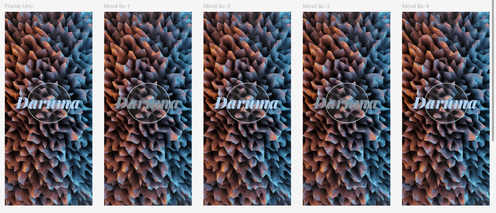
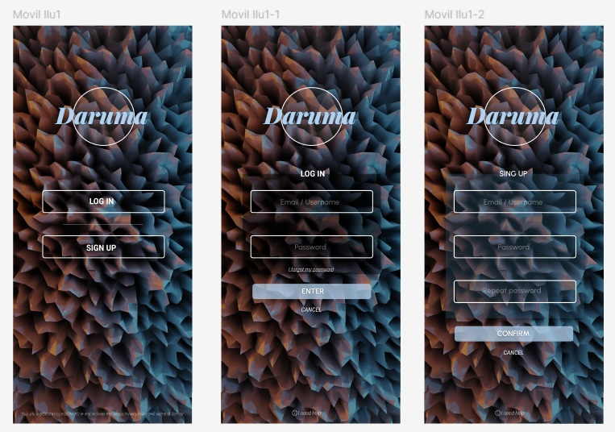
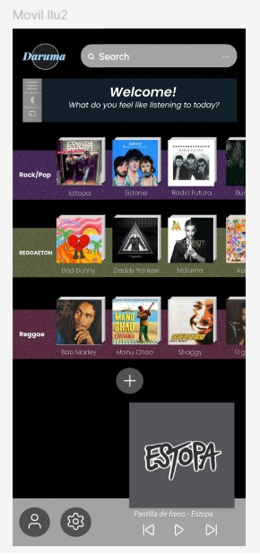
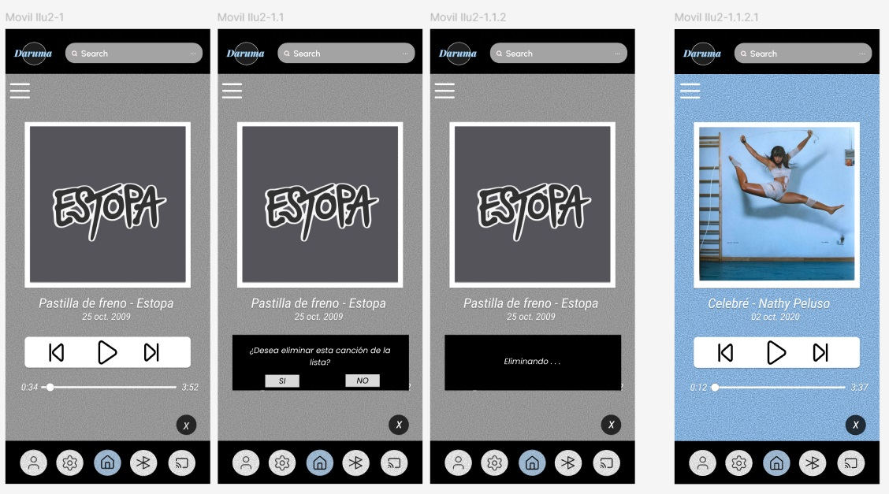
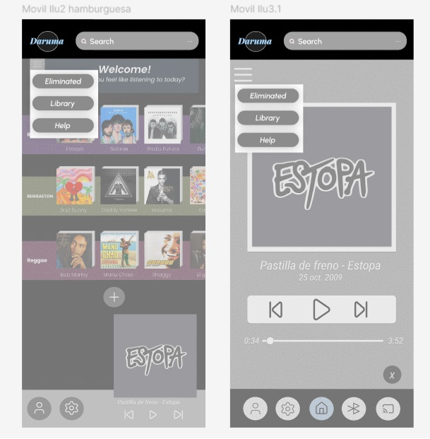

# Actividad de creación de App Musical

## Zona de carga

## Log In y Sing up

## Inicio

## Paso de una canción a otra y/o eliminación de la cola

## Menú de hamburguesa

## Conexiones

## Video prototipado
https://github.com/user-attachments/assets/0b02a45f-49a4-4566-b02c-e3952c98717a
